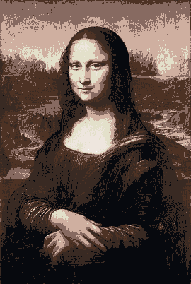
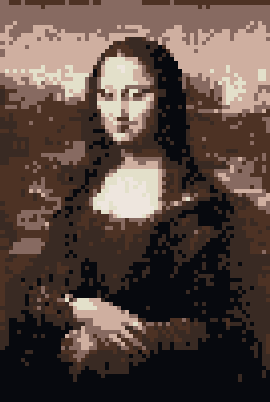

# Minecraft Imager

Generates python code for the Minecraft Education Agent to create a replication of a given image using 8 blocks.

## Instalation

- `git clone https://github.com/jurakin/minecraft-imager`
- `cd minecraft-imager`
- `pip install -r requirements.txt`
- `python3 main.py`

## Preview

The `pixelate scale` indicates how pixelated the image is. So a pixelate scale of 4 means that the size of the image is divided by 4 (the resulting pixel scale value of 4 is 1/4 and so on).

Each square in the picture represents exactly one minecraft block.

| Property | Mona Lisa                 | Mona Lisa Pixelated (1x)             | Mona Lisa Pixelated (4x)                |
| -------- | ------------------------- | -----------------------------------  | --------------------------------------- |
| Image    |  |  |  |
| Size     | 270x402                   | 270x402                              | 67x100                                  |
| Printing | -                         | 3h 0m 54s                            | 11m 10s                                 |

## How it works

The program is working in following steps:

- Converts the input image to grayscale
- Pixels the image based on the scale number
- Assigns the corresponding colours to the image
- Then converts it to a list, which is called an instruction
- Compresses the list using gzip and encodes it using base85
- Inserts the instructions into the code

## Known issues

- The agent must be within render distance in order to work.

## License

This program is released under GPL-3.0 license.
